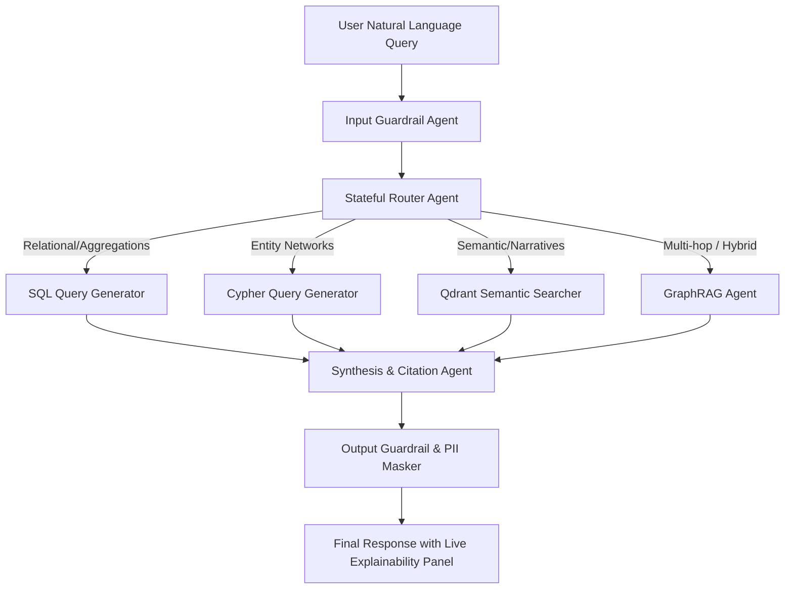

# AI Engine Architecture Document

This document outlines the AI strategies, model pipelines, agent routing topologies, and guardrail rules for the KSP Crime Intelligence Platform.

---

## 1. Multi-Agent Conversation Routing (LangGraph)

The core interaction layer is built on **LangGraph**, enabling a stateful, cyclic agent loop that can dynamically call tools and synthesize answers.

### LangGraph State Schema
The state object keeps track of:
- `messages`: Historical conversation context.
- `sql_query`: Current generated PostgreSQL query.
- `cypher_query`: Current generated Neo4j query.
- `retrieved_docs`: Raw chunks returned from Qdrant/PostgreSQL.
- `graph_context`: Nodes and edges traversed in Neo4j.
- `explainability_data`: Performance times, executed queries, and confidence.
- `pii_masked`: Boolean state of the citizen-safe demo mode.

---

## 2. Structured SQL Generation Agent

To allow officers to query structured metrics (e.g. "How many thefts were registered in Bangalore South district in Q2 2026?"):

1. **System Prompt & Schema Definition**: The SQL Agent is injected with DDL statements of PostgreSQL tables, constraints, and select lookup values (such as list of districts and major crime heads).
2. **Execution Guardrails**: Only read-only queries are permitted (`SELECT`). A parser checks the SQL AST (Abstract Syntax Tree) to block any modifying statements (`INSERT`, `UPDATE`, `DROP`).
3. **Execution Plan Explainability**: Along with the final dataset, the LLM outputs the raw SQL executed, which will be visible in the frontend's **Explainability Panel**.

---

## 3. Graph RAG & Knowledge Graph Engine

For queries about suspect connections (e.g. "Find all repeat offenders linked to Case Master ID 104 who share phone numbers with known members of Gang B"):

1. **Cypher Generator**: The agent uses LlamaIndex or LangChain templates to map the user's entities to a Cypher query.
2. **Context Enrichment**: The retrieved Neo4j sub-graph is merged with the corresponding CaseMaster details from PostgreSQL and vector embeddings of crime briefs from Qdrant.
3. **Output format**: Graph results are returned as a JSON structure containing lists of `nodes` and `edges` compatible with **React Flow** rendering.

---

## 4. Conversation Memory & Semantic Caching

- **Redis Semantic Cache**: Before invoking the LLM, the system generates embeddings of the user's question and checks Redis. If a semantically similar query (threshold > 0.95) was run within the last hour, the cached response is served, reducing LLM costs and achieving sub-100ms response times.
- **Session Memory**: Conversation turns are maintained via a Redis-backed `ChatMessageHistory`. The history is fed back into the Router Agent as context for coreference resolution (e.g., matching "Who was the accused?" followed by "Where does *he* live?").
- **PDF Conversation Export**: A dedicated API compile-renders the Markdown-formatted conversation history, including generated charts and maps, into a print-ready PDF using a template library (e.g. ReportLab or Weasyprint).

---

## 5. Guardrails & Citizen-Safe Masking

- **Prompt Injection Defense**: Input text is evaluated by a small classifier model to flag adversarial prompts designed to leak system instructions.
- **PII Masking Pipeline**:
  - When **Demo Mode** is toggled ON, the Synthesis Agent invokes a NER (Named Entity Recognition) pipeline customized for Indian names, phone numbers, and addresses.
  - Detected entities are replaced by tokens (e.g. `<SUSPECT_A>`, `<PHONE_9XXXX>`).
  - Relational joins on `ComplainantDetails`, `Victim`, and `Accused` tables selectively select masked fields.
