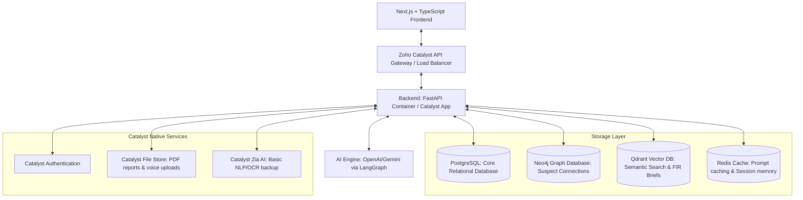

# Architecture Document

This document outlines the high-level system architecture, service components, data flows, and Zoho Catalyst integration points for the KSP Crime Intelligence Platform.

---

## 1. System Architecture Diagram

---

## 2. Component Specifications

### 2.1 Backend Core (FastAPI)
- Built on Python FastAPI, executing asynchronously to support streaming LLM responses and heavy network requests.
- Implements Clean Architecture principles: Domain models, repository layers, and service layers are decoupled from database clients.
- Uses **SQLAlchemy** (or Tortoise ORM) for PostgreSQL access and **neomodel** (or official neo4j driver) for Graph operations.

### 2.2 AI Conversational Engine (LangGraph & LlamaIndex)
- Structured as a multi-agent LangGraph workflow.
- **Router Agent**: Analyzes user intent (e.g., trend calculation, connection analysis, individual lookup) and routes to specific specialist sub-agents:
  1. **SQL Agent**: Translates NL questions into Postgres queries, runs them, and explains the query execution to ensure transparency.
  2. **Graph RAG Agent**: Generates Cypher queries for Neo4j, traversing paths between accused/victims and returning subgraph contexts.
  3. **Vector Search Agent**: Performs dense embeddings searches on case summaries (FIR `BriefFacts`) in Qdrant.
  4. **Synthesis Agent**: Merges answers from SQL, Graph, and Vector outputs, validates against prompt guardrails, and renders a citation list.

### 2.3 Frontend Interface (React & Next.js)
- Responsive Single-Page Application (SPA) leveraging **TypeScript**, **TailwindCSS**, and **Shadcn UI** for cohesive, premium aesthetics (Dark Mode / Glassmorphism).
- **React Flow**: Renders suspect graphs dynamically, showing connections like calls (CDR), relationships, and financial transactions.
- **Leaflet / MapLibre GL**: Visualizes spatiotemporal hotspots and station-level polygons.
- **Apache ECharts / D3.js**: Interactive, high-performance dashboards with drill-downs for crime trends and district analytics.

---

## 3. Zoho Catalyst Integration Strategy

The project leverages Zoho Catalyst as the serverless host and backend infrastructure manager to meet enterprise governance and rapid deployment parameters:

- **Catalyst App Hosting (Client)**: Hosts the production Next.js static export / application frontend.
- **Catalyst App Hosting (Server)**: Runs the Dockerized FastAPI backend, enabling elastic scaling and unified URL routing.
- **Catalyst Authentication**: Handles user sign-up, password policies, and multi-factor validation. JWT tokens are verified by FastAPI for RBAC.
- **Catalyst File Store**: Used for storing generated PDF investigation summaries, uploaded voice recordings (Whisper transcription inputs), and exported reports.
- **Catalyst Zia AI API**: Leveraged for optional Optical Character Recognition (OCR) on scans of uploaded chargesheets.

---

## 4. Security Architecture

- **Role-Based Access Control (RBAC)**: Custom JWT claims identify the officer's Rank and Station ID. Column-level and row-level masking are applied in Postgres to hide names and sensitive records if the officer lacks clearance.
- **Citizen-Safe Demo Mode**: Middlewares scan JSON outputs and replace specific columns (Names, KGIDs, Phone numbers) with placeholders (e.g., `A-1 [MASKED]`) when demo mode is active.
- **Prompt Injection & Guardrails**: LLM inputs pass through a validation layer (NeMo Guardrails or a custom semantic check) to block attempts to bypass system constraints.
- **Cryptographic Audit Logs**: Every API request and data access event is logged into a dedicated audit table with SHA-256 integrity hash verification.
