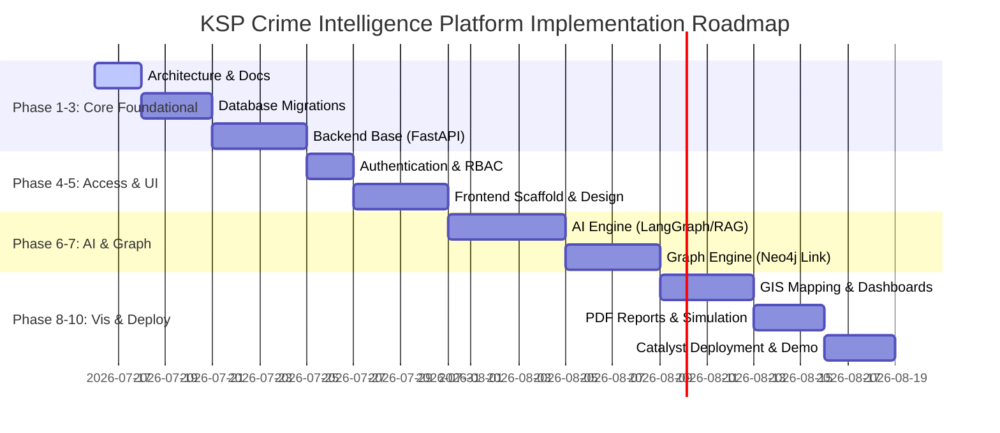

# Project Roadmap & Implementation Phases

This document details the phased implementation strategy for the KSP Crime Intelligence Platform. Each phase represents a distinct milestone that requires review and approval before proceeding.

---

## Roadmap Overview

---

## Phase Breakdowns

### Phase 1: Architecture & Documentation (Current Phase)
- **Goal**: Create directory structures, detail system components, design database mappings, define API signatures, and write coding rules.
- **Deliverables**: PRD, Architecture, Database, AI, Design, API, Rules, Phases, TechStack, and Memory files in `docs/`.
- **Review Trigger**: Approval of Phase 1 files.

### Phase 2: Database Setup & Migration
- **Goal**: Spin up local PostgreSQL instance, write SQL schema files based on KSP ER model, and write seeding scripts with synthetic data.
- **Deliverables**: Database migrations, DDL scripts, SQL seed files, and validation scripts verifying relationships.

### Phase 3: Backend Core Development
- **Goal**: Set up the FastAPI framework, build ORM models, create repository layers, and build standard CRUD and search endpoints.
- **Deliverables**: FastAPI base application, unit test framework, CRUD APIs for CaseMaster, Accused, and Victims.

### Phase 4: Authentication & RBAC
- **Goal**: Configure Zoho Catalyst Authentication, build middleware to parse JWT claims, and enforce role permissions.
- **Deliverables**: Auth middleware, role validation hooks, security mock tests.

### Phase 5: Frontend Skeleton & Design System
- **Goal**: Initialize Next.js project with TailwindCSS and Shadcn UI, set up the layout structure (sidebar, chat drawer), and implement the global dark theme.
- **Deliverables**: Next.js scaffolding, global CSS theme system, dashboard layout component, responsive chat shell.

### Phase 6: AI Conversational Engine
- **Goal**: Implement the LangGraph routing agent, integrate Qdrant vector search, and build the structured SQL execution agent.
- **Deliverables**: LangGraph coordinator script, SQL translation prompt, Qdrant indexing script, streaming chat endpoint.

### Phase 7: Graph Engine & Link Analysis
- **Goal**: Integrate Neo4j database, build Cypher query generator, and connect relationship nodes to the conversational assistant.
- **Deliverables**: Neo4j client connection, Cypher agent tool, graph payload generator, community detection analytics.

### Phase 8: GIS & Map Visualizations
- **Goal**: Embed Leaflet maps in frontend, map spatial coordinates of CaseMaster, and build cluster heatmaps.
- **Deliverables**: Map component, spatiotemporal filters, heat-cluster overlays, emerging spike alert markers.

### Phase 9: PDF Reports & Scenario Simulation
- **Goal**: Integrate PDF generation library to export chat transcripts and case summaries, and build a trend simulation dashboard.
- **Deliverables**: PDF export function, scenario simulator charts (Patrol frequency vs Crime Rate model).

### Phase 10: Catalyst Deployment & Demo Prep
- **Goal**: Containerize FastAPI, deploy Client to Catalyst App hosting, configure environment secrets, and verify Demo Mode PII masking.
- **Deliverables**: Dockerfiles, catalyst.json config, GitHub actions workflow, final testing verification walkthrough.
